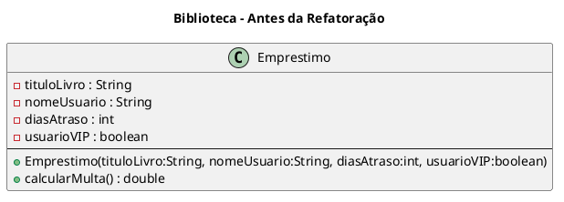
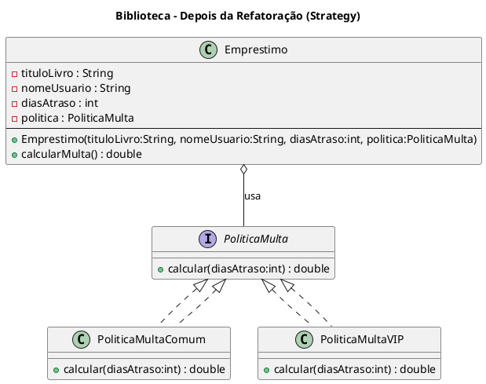

# Aula ao Vivo – Refatoração de Código (Desenvolvimento de Sistemas II)


Material de apoio para a **Aula 2 – Refatoração**

---

## Conceitos Fundamentais 📖

- **Refatoração**: processo de modificar a estrutura interna de um código **sem alterar seu comportamento externo** (Fowler, 1999).
- Objetivos:
  - Melhorar **clareza** e **legibilidade**.
  - Aumentar **cohesão** e **reuso**.
  - Reduzir riscos de **bugs futuros**.
- **Bad Smells**:
  - Termo introduzido por Kent Beck e popularizado por Martin Fowler.
  - Não são bugs, mas sintomas de problemas de design (métodos longos, classes com muitas responsabilidades, condicionais complexas, etc.).

---

## Categorias de Técnicas 📖 

1. **Composing Methods** – dividir métodos longos.
2. **Movendo funcionalidades entre objetos** – respeitar responsabilidades.
3. **Organizando dados** – trocar arrays “crus” por objetos.
4. **Simplificando condicionais** – usar polimorfismo ou objetos nulos.
5. **Simplificando chamadas de métodos** – separar consulta de modificação.
6. **Lidando com generalização** – criar superclasses quando há padrões comuns.

Fonte: Fowler (1999), Refactoring Guru.

---

## Estudo de Caso: Sistema de Biblioteca 📚

### Código Original (Antes da Refatoração)

```java
public class Emprestimo {
    private String tituloLivro;
    private String nomeUsuario;
    private int diasAtraso;
    private boolean usuarioVIP;

    public Emprestimo(String tituloLivro, String nomeUsuario, int diasAtraso, boolean usuarioVIP) {
        this.tituloLivro = tituloLivro;
        this.nomeUsuario = nomeUsuario;
        this.diasAtraso = diasAtraso;
        this.usuarioVIP = usuarioVIP;
    }

    public double calcularMulta() {
        double multa = 0;
        if (diasAtraso > 0) {
            if (usuarioVIP) {
                multa = diasAtraso * 1.0;
            } else {
                multa = diasAtraso * 2.0;
            }
            if (diasAtraso > 10) {
                multa += 20;
            }
        }
        return multa;
    }
}
```

### Problemas Identificados
- Método **calcularMulta** muito longo.
- **Condicionais aninhadas**.
- Regras de negócio **espalhadas** e pouco reutilizáveis.

---

## Refatoração Aplicada (Strategy Pattern) 

### Criação de Políticas de Multa

```java
public interface PoliticaMulta {
    double calcular(int diasAtraso);
}

public class PoliticaMultaComum implements PoliticaMulta {
    public double calcular(int diasAtraso) {
        double multa = diasAtraso * 2.0;
        if (diasAtraso > 10) multa += 20;
        return multa;
    }
}

public class PoliticaMultaVIP implements PoliticaMulta {
    public double calcular(int diasAtraso) {
        double multa = diasAtraso * 1.0;
        if (diasAtraso > 10) multa += 20;
        return multa;
    }
}
```

### Classe Emprestimo Refatorada

```java
public class Emprestimo {
    private String tituloLivro;
    private String nomeUsuario;
    private int diasAtraso;
    private PoliticaMulta politica;

    public Emprestimo(String tituloLivro, String nomeUsuario, int diasAtraso, PoliticaMulta politica) {
        this.tituloLivro = tituloLivro;
        this.nomeUsuario = nomeUsuario;
        this.diasAtraso = diasAtraso;
        this.politica = politica;
    }

    public double calcularMulta() {
        if (diasAtraso <= 0) return 0;
        return politica.calcular(diasAtraso);
    }
}
```

### Uso

```java
Emprestimo comum = new Emprestimo("Java Básico", "Maria", 12, new PoliticaMultaComum());
System.out.println("Multa comum: " + comum.calcularMulta());

Emprestimo vip = new Emprestimo("Clean Code", "Carlos", 12, new PoliticaMultaVIP());
System.out.println("Multa VIP: " + vip.calcularMulta());
```

---

## 📊 Diagramas UML

### Antes da Refatoração


### Depois da Refatoração


---

## Atividade em Aula

Refatore um **cálculo de desconto em e-commerce** que mistura:
- desconto por cupom,  
- desconto por quantidade,  
- desconto para cliente fiel.  

👉 Objetivo: aplicar **Extract Class** + **Strategy** para separar regras de desconto.

---

## Solução


## ✨ Conclusão

- Refatorar não é otimizar performance, e sim **melhorar design**.  
- Técnicas de refatoração aumentam a **clareza, manutenibilidade e extensibilidade**.  
- O exemplo mostrou como **substituir condicionais complexas por polimorfismo**, deixando o código mais elegante.

---
